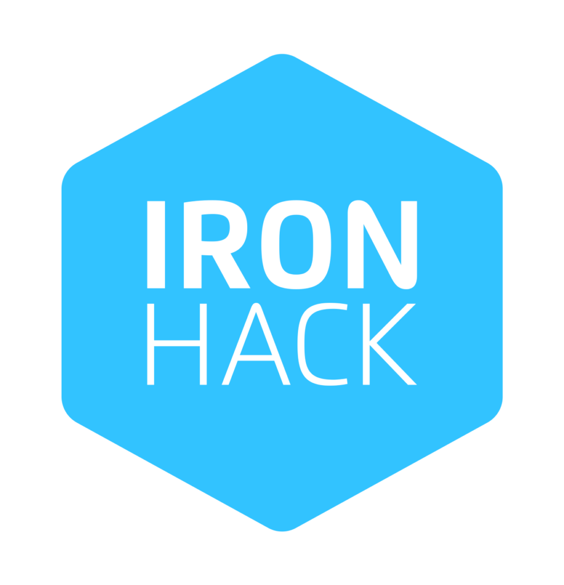

<!-- PROJECT LOGO -->
 

  

  <h3 align="center">JAVA Part Time BootCamp</h3>

  

    Initial page for Video recordings.
     
    <a href="https://github.com/iron-toni/bc2024"><strong>Explore the docs »</strong></a>
     
     
    <a href="https://github.com/iron-toni/bc2024">Repository root</a>
    ·
    <a href="https://github.com/iron-toni/bc2024/Projects">Projects</a>
    ·
    <a href="https://github.com/iron-toni/bc2024/Recordings">Recordings</a>
  

<!-- TABLE OF CONTENTS -->

  
Table of Contents

  <ol>
    <li>
      <a href="#about-the-bootcamp">About The Bootcamp</a>
      <ul>
        <li><a href="#Week-1-Session-1">Week 1 Session 1</a></li>
        <li><a href="#Week-1-Session-2">Week 1 Session 2</a></li>
      </ul>
    </li>
  </ol>

<!-- ABOUT THE PROJECT -->

## About The Bootcamp

[![Projects]](../Projects/)

(<a href="#readme-top">back to top</a>)

### Week 1 Session 1

Kick off and first class, welcome to Ironhack, Java fundamentals, basic conditional block structures.

## [Week 1 Day 1](https://ironhack.zoom.us/rec/share/OBT17YOfwGxgoHAso_3d5EMhSHMuPqGHrQk7hqvm0usJC5NPQUVPSRuIInCruHY.I9QoXuNmZKCfV-Ow?startTime=1706029552000)

[![Week 1 Day 1 Project]](../Projects/Week1S1/)

(<a href="#readme-top">back to top</a>)

### Week 1 Session 2

Warming up, Loop structures and Arrays. The wonderful world of Git and Github.
[Week 1 Day 2](https://ironhack.zoom.us/rec/share/M8QQy3tbZoL7jWRgwH9FSH1ORQfBxs75zwQ0yUu4vfvBalng7gBrERADk2e-Te05.7bJS1YFnOxumz5mn?startTime=1706203512000)

---

[![Week 1 Day 2 Project]](../Projects/Week1S2/)

(<a href="#readme-top">back to top</a>)

